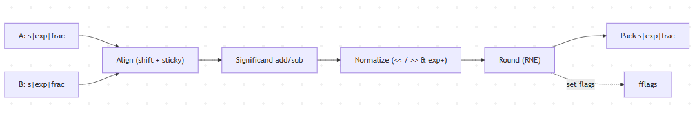

# Adam Kaci CPU Design and Simulation Project

In this project, I designed and simulated a simple 32-bit RISC-V CPU that implements a subset of the RV32I (32-bit base integer, little-endian) instruction set architecture (ISA). 

## Features

<!-- AI-BEGIN -->
- **Two’s-Complement Toolkit (RV32 width)**
  - Encode/decode 32-bit two’s-complement
  - Sign/zero extend helpers
  - Pretty printers (hex, binary grouped by **bytes**)
- **ALU (RV32I subset)**
  - `ADD`, `SUB`, `AND`, `OR`, `XOR`, `SLL`, `SRL`, `SRA`
  - Flags: **N** (negative), **Z** (zero), **C** (carry), **V** (signed overflow)
- **Shifter**
  - 5-stage barrel shifter (1/2/4/8/16)
- **MDU (RV32M multiply/divide)**
  - Multiply: `MUL` (low 32), `MULH`, `MULHU`, `MULHSU`
  - Divide/Remain: `DIV`, `DIVU`, `REM`, `REMU` (restoring division)
  - RISC-V edge semantics (e.g., DIV by 0, INT_MIN / −1), plus step-by-step **traces**
- **FPU (IEEE-754 float32)**
  - Pack/unpack, `fadd`, `fsub`, `fmul`
  - Round-to-Nearest-Even (RNE)
  - Flags: **invalid**, **divide_by_zero**, **overflow**, **underflow**, **inexact**
  - Step-by-step **traces** (align, op, normalize, round)
- **FCSR**
  - `frm` (rounding mode; defaults to RNE=0)
  - `fflags`: NV, DZ, OF, UF, NX
  - CLI shows FCSR bits for FPU ops
- **Register Files**
  - Integer RF (x0 hard-wired to 0), FP RF, simple `Reg` primitive
- **Program Image Loader**
  - Reads standard `.hex` file (one 32-bit word per line)
- **Tiny “runner”**
  - Executes a minimal demo program image to show core pieces working

## Required Initial Setup

- Python **3.12+**
- Windows PowerShell, a POSIX shell, or some IDE Terminal

### Install (editable)
```bash
python -m venv .venv
# Windows PowerShell:
. .venv/Scripts/activate
# macOS/Linux:
# source .venv/bin/activate

pip install -e .
pytest
```
<!-- AI-END -->

Important note, if for some reason your python code is not running for any particular reason, instead attempt to run the code via:
```bash
py -m venv .venv
```
Swap out any commands that start with **python** with **py**, hopefully that should help.

## How to run program

The project installs a console script named `SD-sim`.

### Command summary

```bash
SD-sim [-h] {add,sub,fadd,fsub,fmul,mul,div,loadhex,runhex} ...
```
### 1. Integer ALU ops (two’s-complement 32-bit)

```bash
SD-sim add <a> <b>
SD-sim sub <a> <b>
```
- `<a>`, `<b>`: Python int literals (accepts decimal like 5 or bases like 0xFF, 0b1010).
- Output: 32-bit result + ALU flags ```{N,Z,C,V}```.

### Examples

```bash
SD-sim add 0x7FFFFFFF 1
SD-sim sub 0x80000000 1
```

### 2. Float32 FPU ops (hex bit patterns)

```bash
SD-sim fadd <hex32> <hex32>
SD-sim fsub <hex32> <hex32>
SD-sim fmul <hex32> <hex32>
```
- Operands are raw hex bit patterns (8 hex digits, with or without 0x).
- Output: result hex + detailed flags + FCSR view.
- Prints algorithm trace lines when relevant.

### Examples

```bash
SD-sim fadd 3FC00000 40100000          # 1.5 + 2.25 = 3.75
SD-sim fmul 7E967699 41200000          # ~1e38 * 10 -> +inf (OF,NX)
SD-sim fadd 7F800000 FF800000          # +inf + -inf -> qNaN (NV)
```

### Multiply/Divide Unit (RV32M)

```bash
SD-sim mul <a:int> <b:int> [--trace]
SD-sim div <a:int> <b:int> [--unsigned] [--trace]
```
- **mul** computes **MUL** (low 32) with an overflow visibility flag (if 64-bit product doesn’t fit a signed 32-bit).
- **div** supports **DIV** (signed) and **DIVU** (**--unsigned**). Remainder behavior matches RISC-V. Division by zero and **INT_MIN / -1** edges are handled.
- **--trace** shows per-step shift-add (mul) or restoring division iterations.

### Examples

```bash
SD-sim mul 12345678 -87654321 --trace
SD-sim div -7 3
SD-sim div 0x80000000 3 --unsigned --trace
```

### Program image (hex) loader & mini runner

```bash
SD-sim loadhex <path>
SD-sim runhex  <path> [--trace]
```
- **loadhex** just parses and reports how many 32-bit words were loaded.
- **runhex** executes a tiny demonstration over your core components (simple ALU/shifter/FPU/MDU demo path, not a full ISA interpreter), reporting final register/memory values consistent with the provided sample.

### Example

```bash
SD-sim loadhex test_base.hex
SD-sim runhex test_base.hex
```
Smaple file (as provided): [test_base.hex](./test_base.hex)

### Program image format
- One 32-bit instruction per line, exactly 8 hex digits (no **0x**)
- One word per line, blank lines allowed, comments avoided for portability

## Example Inputs (copy/paste)

```bash
# ALU
SD-sim add 0x7FFFFFFF 1
SD-sim sub 0x80000000 1

# FPU
SD-sim fadd 3FC00000 40100000
SD-sim fmul 7E967699 41200000
SD-sim fadd 7F800000 FF800000

# MDU
SD-sim mul 12345678 -87654321 --trace
SD-sim div -7 3
SD-sim div 0x80000000 3 --unsigned --trace

# Loader / Runner
SD-sim loadhex test_base.hex
SD-sim runhex test_base.hex
```

## Example Outputs

```bash

# Loader
> SD-sim loadhex test_base.hex
Loaded 11 words from test_base.hex

# Runner
> SD-sim runhex test_base.hex
Completed in 10 steps, PC=0x00000028
x1 = 0x00000005
x2 = 0x0000000A
x3 = 0x0000000F
x4 = 0x0000000F
x5 = 0x00010000
x6 = 0x00000002
mem[0x00010000] = 0x0000000F
```

## Project layout

```bash
src/
  alu.py
  fcsr.py
  fpu.py
  gates.py
  loader.py
  main.py
  mdu.py
  memory.py
  registers.py
  runner.py
  shifter.py
  twos.py
tests/
  test_alu.py
  test_fcsr.py
  test_fpu.py
  test_mdu_divu_remu.py
  test_mdu.py
  test_registers.py
  test_shifter.py
  test_shifter.py
  test_twos.py
tools/
    gen_ai_report.py
```

## Constraints & style (enforced in impl modules)

- No host numeric shortcuts in implementation paths:
    - Forbidden inside impl: **+ - * / % << >>**, built-in base conversions **(int(..., base), bin(), hex(), format())**, float math
    - All arithmetic is done via bit-level logic (full adders, shifter, etc.)
- Data carried as bit vectors (**Tuple[Bit, ...]**), MSB-first
-  Pretty-print binary grouped by bytes; hex is always zero-padded
- Clean separation of concerns; pure, testable functions; deterministic behavior

## Testing

Run the full test suite:
```bash
pytest
```
You should see all tests pass. Current suite includes:
- Two’s-complement encode/ decode (boundaries, overflow)
- ALU (ADD/SUB corner cases, flags; shifts)
- Shifter (SLL/SRL/SRA)
- MDU (MUL low32 + overflow visibility; MULH/MULHU/MULHSU; DIV/REM with RISC-V edges)
- FPU (normal/subnormal/inf/NaN, rounding to even, flags & traces)
- FCSR propagation (NV/DZ/OF/UF/NX)
- Registers (x0 hard-wired to zero; FP regs; Reg load/clear)

Example passing run:
```bash
========================== 61 passed in 0.49s ==========================
```

## Branch Strategy

Branches were handled with the sole intent of keeping the main branch safe in case any changes resulted in bricking or test failure where there previous wasn't.

## Traces

Most multi-step operations (MDU + FPU) produce cycle-by-cycle traces that show the internal algorithm decisions. Use **--trace** on CLI subcommands to print them.

### What traces show

- MDU / DIV* (restoring division)
    - **DIV start: restoring unsigned** -- algorithm selected
    - **DIV stepN: keep (R>=D)** -- subtraction succeeded; quotient bit 1
    - **DIV stepN: restore (R<D)** -- subtraction underflowed; rever; quotient bit 1
- MDU / MUL* (shift-add multiplier)
    - **MUL stepN: add** -- multiplier LSB was 1; partial product added
- FPU add/sub/mul
    - **ALIGN:** -- exponent alignment shifts (with sticky)
    - **OP:** -- actual significand op (add/sub or 24x24 shift-add)
    - **NORMALIZE:** -- normalization steps (shift and exponent adjust)
    - **PACK:** -- packing/overflow/underflow decisions
    - Any special cases (NaN/infinity/signed-zero) are called out as **SPECIAL:** lines
Exception flags are latched into FCSR.fflags and shown after each FPU command:
- **NV** (invalid), **DZ** (divide by zero), **OF** (overflow), **UF** (underflow), **NX** (inexact)

### Examples

### Unsigned divide (DIVU) with trace

```bash
SD-sim div 0x80000000 3 --unsigned --trace
```

### Output:

```bash
DIVU: q=0x2AAAAAAA r=0x00000002 overflow=False
DIV start: restoring unsigned
DIV step0: restore (R<D)
DIV step1: restore (R<D)
DIV step2: keep (R>=D)
...
DIV step30: keep (R>=D)
DIV step31: restore (R<D)
```

Interpretation:
- Quotient bits are formed MSB→LSB across 32 steps.
- **keep** marks a 1-bit; **restore** marks a 0-bit.
- Sanity: **q*divisor + r == dividend, 0 ≤ r < divisor**.

### Multiply (MUL low32) with trace

```bash
SD-sim mul 0x00BC614E 0xFA0A1F4F --trace
```

#### Sample output (abridged):
```bash
MUL: rd=0xD91D0712 overflow=True
MUL start: 32x32 -> 64 shift-add
MUL step21: add
MUL step23: add
...
```
Interpretation
- Each **stepN: add** indicates the multiplier’s current LSB was 1 → partial product added at offset N.
- **overflow=True** indicates the full 64-bit product cannot be represented as signed 32-bit.

## Merge guidance (for a larger CPU later)

- Keep the NumericCore API:
    - **alu32(rs1,bits,op), mdu_mul(op, rs1, rs2), mdu_div(op, rs1, rs2)**
    - Use **State{ regs, fregs, fcsr } and pure functions that transform state
    Avoid global state; make traces easy to capture in tests

## Block diagram

### High-level block diagram 



### FPU add/sub pipeline sketch


## Scan Project for AI Usage

Run the following prompt to activate the **gen_ai_report.py** script by doing the following:
```bash
py tools/gen_ai_report.py